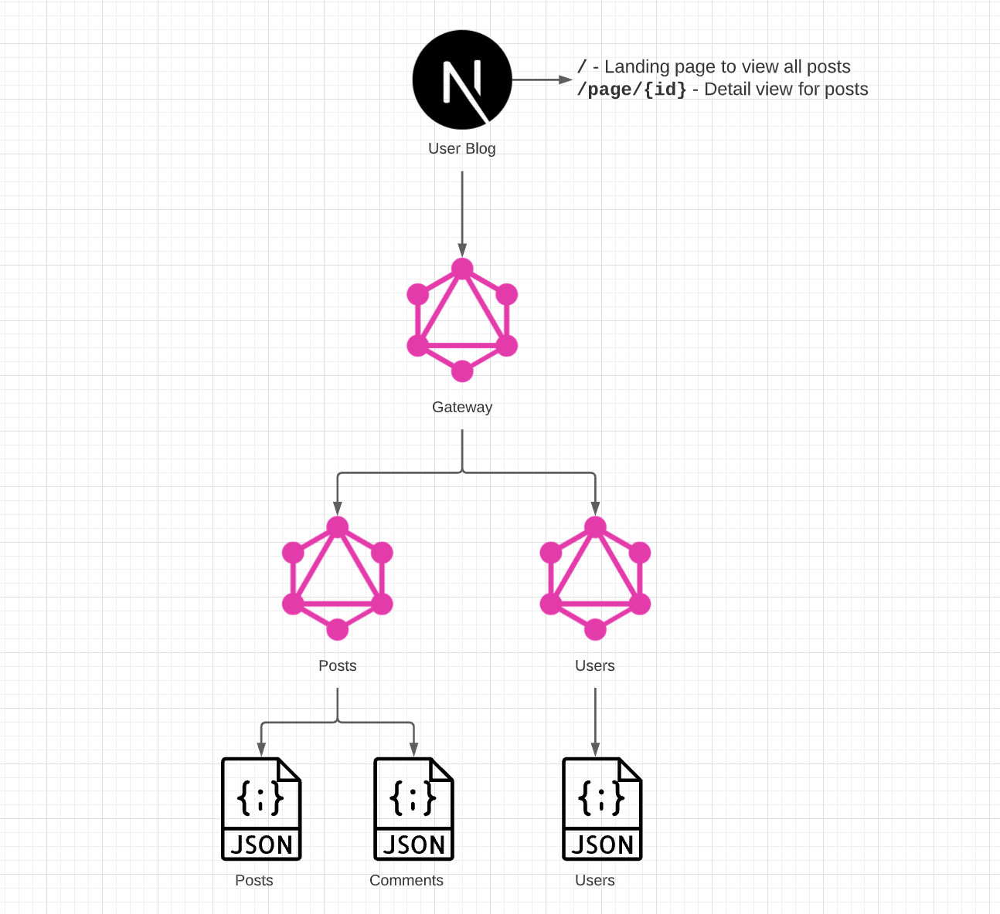

## A Cloud Guru code challenge
Welcome to the A Cloud Guru code challenge! This test is designed to simulate our full stack development environment. In this code challenge you will be asked to make changes to both the backend and frontend applications.

## Objective
We are looking to expand our super bare bones user blog application to include a new detailed view for our user posts.
In this new view we would like to include the following

- Create detailed view for user posts
- Page header: must include a back button to the landing page, include post title, and author name
- Post body: must display the full text of a user blog post
- Comment section: must display the list of comments for the post being displayed. The comments must include the name of the person that made the comment and the comment text.

Below is the skeleton of what the UI should look like.

## Bonus Objectives
There are some existing bugs/feature requests out there with the application. If you have some time lets take care of a few of these.

- Cannot right click to open posts in a new tab
- We need to see the name of the author of the posts on the landing page
- Post landing page isn't showing the description for the posts. We would like to show the first 25 characters of each post.
- There is no loading indicator while all posts are loading
- We need to be able to search through the posts by title
- We would like to add a new comment to a post

## Project overview
This sample application consists of two graphql services, one graphql gateway, and one react frontend app.

### Commands
There are a few helper commands to install dependencies or start application from the root directory.

`yarn install:backend`: install dependencies for all backend services

`yarn start:backend`: start all backend service concurrently

`yarn install:graphiql`: install dependencies for `graphiql` application

`yarn start:graphiql`: start `graphiql` application

`yarn install:app`: install dependencies for `user-blog` React application

`yarn start:app`: start `user-blog` React application

`yarn cleanup`: clean-up node_modules in all services

### Post Service
This is our backend application in the `backends/PostService` folder. This app uses [apollo server](https://www.apollographql.com/docs/apollo-server/) and is implemented with [apollo federation](https://www.apollographql.com/docs/federation/).

You can start this app by navigating to `backends/PostService` then `yarn install` and `yarn start`

### User Service
This is our backend application in the `backends/UserService` folder. This app uses [apollo server](https://www.apollographql.com/docs/apollo-server/) and is implemented with [apollo federation](https://www.apollographql.com/docs/federation/).

You can start this app by navigating to `backends/UserService` then `yarn install` and `yarn start`

### Gateway Service
This is our backend application in the `backends/Gateway` folder. This app uses [apollo server](https://www.apollographql.com/docs/apollo-server/) and is the [apollo gateway](https://www.apollographql.com/docs/federation/gateway/) for our apollo federation.

You can start this app by navigating to `backends/Gateway` then `yarn install` and `yarn start`
### User Blog
This is our frontend application in the `frontends/user-blog` folder. This app is uses [next.js](https://nextjs.org/), [ant design](https://ant.design/components/overview/), and [apollo client](https://www.apollographql.com/docs/react/).

You can start this app by navigating to `frontends/user-blog` then `yarn install` and `yarn start`

## Helpers
You can use the `frontends/graphiql` application to help troubleshoot or test any of our backend applications.

You can start this app by navigating to `frontends/graphiql` then `yarn install` and `yarn start`
